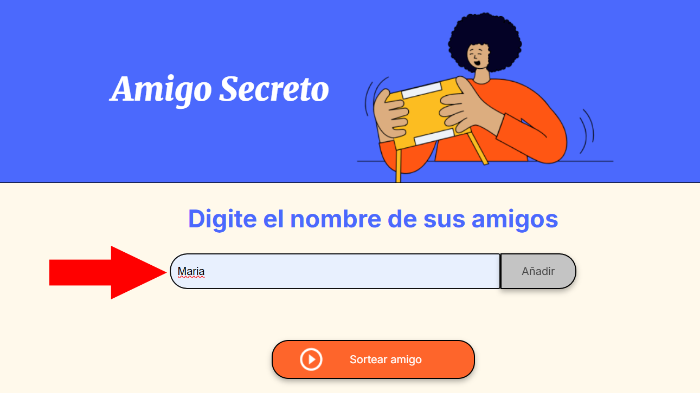
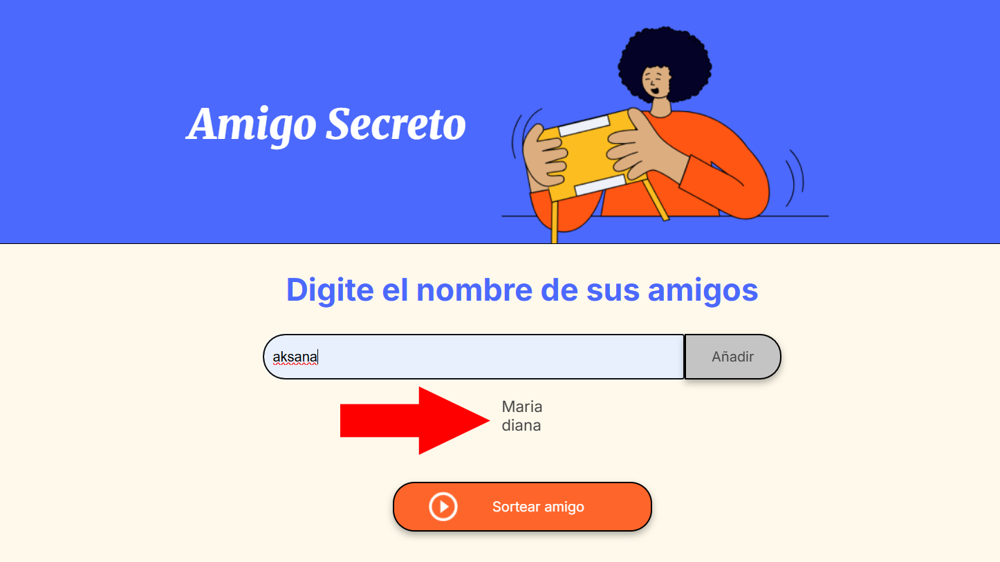
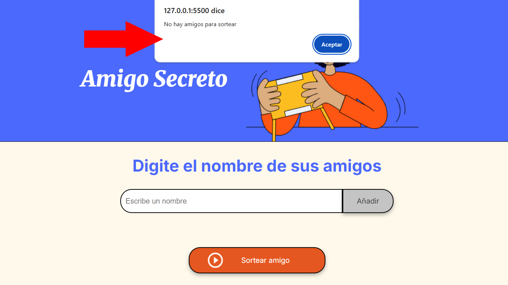
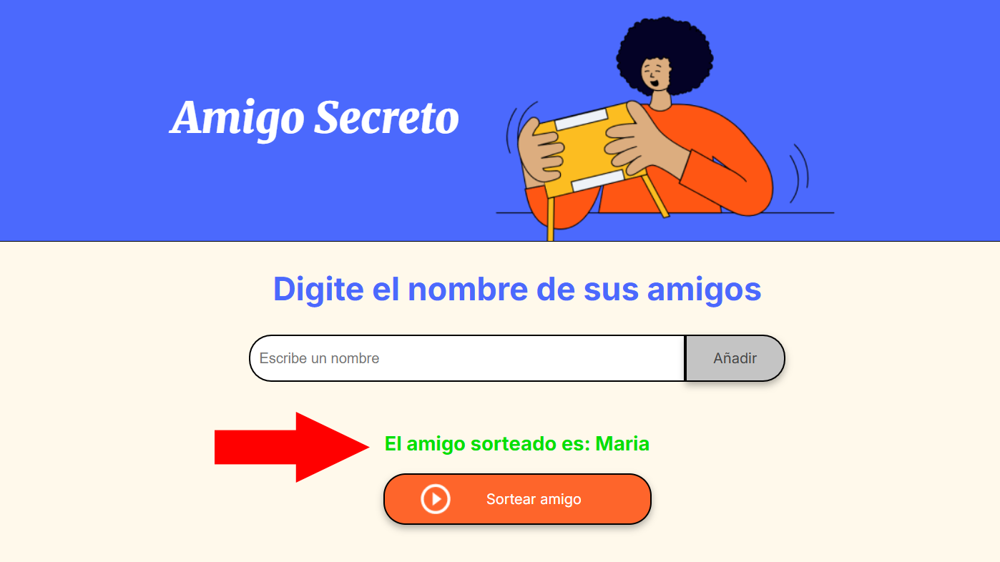

<h1>Proyecto Amigo Secreto</h1>

***Este proyecto es un challenge de Alura Latam & Oracle Next Education.***<br>
- El objetivo de Challenge:<br>
Desarrollar una aplicación que permita a los usuarios ingresar nombres de amigos en una lista para luego realizar un sorteo aleatorio y determinar quién es el "amigo secreto".

- El lenguaje de programación utilizado: Java Script.
<br>
  
Durante el desarrollo del proyecto fueron creadas las siguientes funcionalidades:<br>
  ***1. Función para agregar amigos,*** con las siguientes tareas:<br>
       **- Capturar el valor del campo de entrada:** Utilizar ```document.getElementById``` o ```document.querySelector``` para obtener el texto ingresado por el usuario.<br>
       *El usuario escribe nombres en el campo blanco*<br>
       <br>
       <br>
       **- Validar la entrada:** Implementar una validación para asegurarse de que el campo no esté vacío. Si está vacío, mostrar un ```alert``` con un mensaje de error: "Por favor, inserte un nombre."<br>
       *Si el usuario se apreta el botón ```añadir``` sin ingresar ningún nombre se muestra un mensaje de alerta*<br>
       <br>
       <br>
       **- Actualizar el array de amigos:** Si el valor es válido, añadirlo al arreglo que almacena los nombre de amigos usando el método ```.push()```.<br>
       **- Limpiar el campo de entrada:** Después de añadir el nombre, restablecer el campo de texto a una cadena vacía.<br>
       *El campo blanco se limpia al apretar botón ```añadir```*<br>

  ***2. Función para actualizar la lista de amigos*** con las siguientes tareas:<br>
       **- Obtener el elemento de la lista:** Utilizar ```document.getElementById()``` o ```document.querySelector()``` para seleccionar la lista donde se mostrarán los amigos.<br>
       **- Limpiar la lista existente:** Establecer lista```.innerHTML = ""``` para asegurarse de que no haya duplicados al actualizar.<br>
       *La lista de nombres añadidos se limpia al finalizar sorteo*<br>
       **- Iterar sobre el arreglo:** Usa un bucle ```for``` para recorrer el arreglo ```amigos``` y crear elementos de lista ```(<li>)``` para cada título.<br>
       **- Agregar elementos a la lista:** Para cada amigo, crear un nuevo elemento de lista.
       *La lista de nombres añadidos se muestra en la pantalla*<br>
       <br>
       
 ***3. Función para sortear los amigos,*** con las siguientes tareas:<br>
       **- Validar que haya amigos disponibles:** Antes de sortear, comprobar si el array ```amigos``` no está vacío.<br>
       *Si el usuario no ha ingresado ningún nombre se muestra el mensaje de alerta al apretar botón ```sortear```*<br>
       <br>
       **- Generar un índice aleatorio:** Usar ```Math.random()``` y ```Math.floor()``` para seleccionar un índice aleatorio del arreglo.<br>
       **- Obtener el nombre sorteado:** Utilizar el índice aleatorio para acceder al nombre correspondiente en el arreglo.<br>
       **- Mostrar el resultado:** Actualizar el contenido del elemento de resultado utilizando ```document.getElementById()```  e ```innerHTML``` para mostrar el amigo sorteado.<br>
       *Se muestra en la pantalla un nombre de amigo sorteado al apretar botón ```sortear```*<br>
       <br>
 ***3. Función limpiar el nombre de amigo sorteado en 5 segundos***<br> 
       

